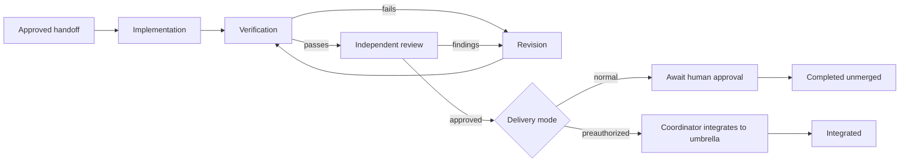

# Delivery Orchestrator

## What this does

This skill owns **one approved issue**. It accepts a validated `handoff.json`
from `portfolio-orchestrator`, creates a draft PR, and normally stops for human
merge approval. It does not re-rank backlog issues.

When the handoff carries a validated unattended-integration authorization, the
PR targets the exact named non-default integration branch. After verification
and independent review pass, the portfolio coordinator—not an implementation or
review specialist—may integrate it under that standing authorization. This mode
never authorizes a merge to the repository default branch.



## Start gate

Before implementation, confirm the issue is still unclaimed, scope and
acceptance criteria are unchanged and testable, instructions and checks are
available, and no newly discovered conflict or sensitive area exists. Otherwise
block for a human decision; never silently broaden scope.

For unattended integration, also validate the authorization artifact and its
hash, require `base_branch == pr_target_branch == integration_branch`, require
that branch to differ from the default branch, and prove the child scope maps to
an accepted-plan section. Record the exact base commit. A missing/mismatched
field disables unattended integration rather than falling back to an unsafe
merge.

## Runtime delegation

For each implementation, review, or revision specialist subagent, prefer the
environment's built-in subagent/worker tool and launch it in a fresh session.
If it is unavailable but `tau` and `tmux` are available, render the assignment
to `prompts/<assignment>.txt` and launch a fresh non-interactive Tau session in
a uniquely named detached tmux session with `tau --print --new-session
--session-id <id> --cwd <cwd>`. Save stdout and exit status under `processes/`.
If neither runtime is available, block before delegation.

Record each specialist subagent's role, runtime, session ID, prompt path, report
path, start time, and terminal outcome. Poll at bounded intervals, never send
interactive keystrokes, preserve logs on timeout, and stop only the named tmux
session. A missing or invalid report is failure; do not infer success from prose.

## Workflow

1. Initialize the run state and artifacts.
2. Launch a fresh implementation specialist subagent with `templates/implement.md`.
3. Independently verify the result with `templates/verify.md`.
4. Launch a fresh independent review specialist subagent with
   `templates/review.md` in a new detached review worktree.
5. If verification or review finds a material issue, launch a fresh revision
   specialist subagent with `templates/revise.md` in the existing implementation
   worktree, then repeat verification and review.
6. Produce `final-report.md` with `templates/final-report.md`.

## Required artifacts

```text
<run>/
  config.json             approved handoff, scope, policy, and checks
  state.json              current workflow state
  transitions.jsonl       append-only transition history
  assignments.jsonl       specialist subagent launches and outcomes
  prompts/ processes/ reports/ verification/ final-report.md
```

Use `scripts/transition-state.mjs`—never an editor—to initialize or change
`state.json`. The script validates JSON, enforces transitions, atomically writes
the new state, and appends its audit record.

## State transitions

| Event | Transition | Evidence |
|---|---|---|
| Start gate passes | `approved → implementing` | handoff |
| Implementation validates | `implementing → verifying` | implementation report |
| Verification passes | `verifying → reviewing` | verification report |
| Verification/review fails | `verifying/reviewing → revising` | relevant report |
| Revision validates | `revising → verifying` | revision report |
| Review approves | `reviewing → awaiting_final_approval` | review report |
| Human declines merge | `awaiting_final_approval → completed_unmerged` | final report |
| Standing integration policy is validated and coordinator verifies merge | `awaiting_final_approval → integrated` | authorization, PR, merge commit, cumulative checks |

`blocked`, `failed`, and `cancelled` are terminal exits from active stages.
`merged` into a default branch requires explicit approval naming the specific PR.
`integrated` is distinct: it is allowed only for a verified merge into the exact
preauthorized non-default integration branch.

## Non-negotiable rules

- One issue gets one implementation branch and worktree, based on the handoff's exact base branch/commit (the remote default branch in normal mode, or current integration branch in unattended mode).
- Implementation and review always use different fresh specialist subagents in
  distinct sessions.
- Every review uses a fresh detached worktree; revisions reuse the implementation
  worktree and PR branch.
- Validate every specialist subagent JSON report and cross-check its branch, worktree,
  commit, and PR before advancing state.
- Never advance from prose alone. Never close issues, publish unrelated comments,
  create a non-draft PR, or merge to the default branch without explicit human
  authority. A validated standing authorization counts only for coordinator-owned
  child integration into its exact non-default branch.
- Implementation, revision, verification, and review specialists never merge.
  The portfolio coordinator serializes and verifies authorized integrations.
