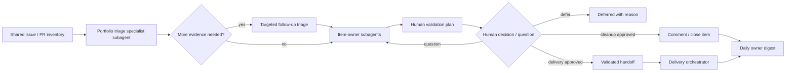

# Portfolio Orchestrator

## What this does

This is the entry point for a workflow that validates issues and PRs in the current repository, and then implements the accepted ones by delegating to `delivery-orchestrator` subagents. 

The first step is to decide **what to work on**, then delegate implementation to `delivery-orchestrator` subagents. It never writes code. Normally it never merges; optional unattended integration mode permits the coordinator to serialize validated child PR merges only into one preauthorized non-default umbrella branch.



`delivery-orchestrator` owns the execution of every selected issue.

## Optional unattended integration mode

Use this mode only when a human explicitly authorizes one accepted umbrella plan
and names a non-default integration branch. It replaces per-child pauses with a
bounded standing policy; it does not weaken verification or authorize delivery
to the default branch.

Read and validate `templates/integration-authorization.md` completely. Record the
accepted policy in `integration-authorization.json`. The mode may automatically:

- decompose the accepted plan into traceable child issues;
- create those child issues and draft PRs;
- dispatch delivery-orchestrator for each child;
- merge a child PR only into the exact named integration branch after delivery
  verification and independent review pass;
- run cumulative integration checks and dispatch bounded repair work;
- continue to the next dependency-ready child without another prompt.

It may never merge the integration branch to the default branch, publish a
release, close the umbrella issue, delete remote branches, broaden the accepted
plan, or bypass a failed check/review. Stop on any authorization stop condition,
material plan change, unresolved security/secret concern, destructive operation,
wrong PR base, exhausted review budget, or irreconcilable integration conflict.

Child dependencies form a DAG. Dispatch only dependency-ready children, cap
concurrency by policy, and serialize writes to the integration branch. Before
merging a parallel child, update it onto the current integration head and repeat
configured verification/review when the candidate commit changes. After every
merge, verify the resulting integration commit; evidence from the isolated child
branch alone is insufficient.

## Runtime delegation

For every specialist subagent, choose the first available runtime. Record whether
it supports resumable non-interactive follow-ups; never infer this from having a
session ID alone.

1. **Native delegation:** use the environment's built-in subagent/worker tool to launch a fresh specialist subagent in a new session.
2. **Non-interactive fallback:** if native delegation is unavailable but a CLI
   runtime and `tmux` are available, render the assignment to
   `prompts/<assignment>.txt`, then launch a fresh non-interactive agent process
   in a uniquely named detached tmux session. Save stdout and exit status under
   `processes/`. Pi owner agents can resume with
   `pi --print --session <id> <prompt>`. Tau owner agents can resume with
   `tau --print --session <id> <prompt>`; use `--session-id <id>` only to create
   their initial print-mode session. Record both as `resumable`. Investigate and
   record the actual capability for any other runtime.

3. **Otherwise:** block before starting the workflow and report that no supported
   delegation runtime is available.

Record the specialist subagent role, runtime, session ID, prompt path, start
time, report path, and terminal outcome. Poll at bounded intervals; never send
interactive keystrokes. On timeout, preserve logs and stop only that named tmux
session—never the tmux server. Treat a missing or invalid report as failure, not
as success inferred from output prose.

## Before starting

Derive the repository, default branch, instructions, checks, open PRs, open issues, active worktrees, and active runs. Ask once for any missing material choice:

- candidate issue scope and accepted project brief;
- selection threshold, concurrency limit, and daily budget;
- permission to dispatch and digest cadence;
- for unattended integration: exact umbrella issue, accepted plan, non-default
  integration branch, allowed actions, concurrency/review/time budgets, required
  checks, and stop conditions.

Default policy: one low-risk issue and draft PRs only. Do not merge or perform
any external maintainer action—such as commenting, closing, relabeling, or
dispatching delivery—until the human has approved that specific item. The sole
exception is a validated unattended integration authorization, which is the
item-specific standing approval for child work traceable to its accepted plan
and only for integration into its named non-default branch.

## Run directory and report paths

Before launching any specialist subagent, create one collision-resistant portfolio
run directory outside project worktrees: `~/.agents/runs/<portfolio-run-id>/`.

```text
<portfolio-run>/
  config.json                 accepted policy and repository facts
  integration-authorization.json  optional bounded standing authorization
  brief.md                    accepted project brief
  inventory.json              immutable shared issues, PRs, and work snapshot
  triage/portfolio.json       shared portfolio triage report
  issues/<issue-id>.json      immutable issue snapshots
  triage/<issue-id>.json      targeted follow-up triage reports, when needed
  owners/<item-id>/dossier.json    item context and related portfolio evidence
  owners/<item-id>/assessment.json plain-English owner assessment
  owners/<item-id>/session.json    runtime and follow-up capability
  owners/<item-id>/followups/      questions and owner responses
  handoffs/<issue-id>.json    validated delivery handoffs
  delivery/<issue-id>.json    delivery-run summary and artifact link
  integration/<issue-id>.json child merge and cumulative-check evidence
  integration/ledger.jsonl    append-only serialized integration history
  human-validation.md         maintainer plan awaiting or recording decisions
  human-validation.html       self-contained maintainer review page
  decisions.jsonl             append-only assessment, approval, and outcome log
  prompts/ processes/         rendered assignments and runtime logs
  transitions.jsonl           append-only portfolio decisions
  daily-digest.md
```

First write `inventory.json`: the immutable shared view of candidates, open PRs,
recent merged work, active branches/worktrees, and active runs. Run one
read-only portfolio triage specialist with `templates/triage.md`; its exact
report path is `triage/portfolio.json`. It must identify duplicates, overlap,
and cross-item dependencies before scoring recommendations.

Use the issue number as `<issue-id>` when available, for example `issue-42`.
Otherwise derive a stable, filesystem-safe identifier. Write a separate issue
snapshot and run a targeted follow-up specialist only when the portfolio report
names a specific unresolved question. Its report path is
`triage/<issue-id>.json`. Validate all required reports before selection. A
selected issue's handoff must be written to
`handoffs/<issue-id>.json`; do not reuse a report path across issues or runs.

For every actionable recommendation (cleanup, delivery, or needs decision),
create one item-owner dossier and launch one fresh read-only item-owner
subagent using `templates/item-owner.md`. It owns ongoing reasoning for that
item, while the portfolio triage report remains the source of cross-item
relationships. Do not create owner agents for track-only or deferred items.

## Human validation and decision log

After item-owner assessments, render both `templates/human-validation.md` and
`templates/human-validation.html` into the run directory. In unattended
integration mode, the accepted umbrella plan and authorization may serve as the
recorded approval for generated child delivery cards; still render the plan for
audit, but do not pause unless a child falls outside that authorization. The HTML page is a
self-contained review interface; it produces a copyable JSON response. Present
every candidate as one of: cleanup candidate, delivery candidate, needs
decision, track only, or defer. Include the evidence, LLM-generated suggested
approach, and proposed external action. Escape all repository and LLM-provided
text before inserting it into HTML. Wait for an item-specific human response
before taking any external action.

When the maintainer pastes a response from the review page, validate it against
the response contract in `templates/decision-log.md`: schema version, run ID,
decision IDs, item IDs, and decision values must match the rendered plan. Ignore
unknown items and do not treat malformed or partial text as approval. Convert
each valid decision into its `human_validation` record. Route each valid
question to the matching item owner. If `session.json` marks the runtime
`resumable`, send it as a follow-up; otherwise launch a fresh read-only owner
session with the dossier, prior assessment, and question. Save the answer under
`owners/<item-id>/followups/`, append an owner-follow-up event, and regenerate
the validation plan. Questions never authorize an external action.

Append one `human_validation` record to `decisions.jsonl` for every valid
decision, using the schema in `templates/decision-log.md`. When an approved
cleanup or delivery action reaches a terminal state, append an `action_outcome`
record with the same `decision_id`. Never rewrite earlier records. Keep secrets,
credentials, and unnecessary personal data out of the log.

## Workflow

1. **Build the shared inventory** of issues, PRs, recent merged work, active
   branches/worktrees, and active runs.
2. **Triage the portfolio** using one fresh, read-only specialist subagent and
   `templates/triage.md`. Require `triage/portfolio.json`; it must identify
   duplicates and issue/PR overlap across the inventory.
3. **Investigate only named gaps** with focused, read-only follow-up specialist
   subagents. Attach their reports to the corresponding portfolio findings.
4. **Assign actionable items** to read-only item-owner subagents using
   `templates/item-owner.md`. Require their plain-English assessment and record
   whether each owner supports resumable follow-ups.
5. **Defer** duplicates, active work, unclear/untestable work, misalignment,
   unresolved product decisions, policy conflicts, and sensitive work. Security,
   authentication, billing, destructive migration, production infrastructure,
   privacy, and legal work always need a human decision.
6. **Prepare human validation** with the Markdown plan and self-contained HTML
   review page. Rank delivery candidates by score, user value, lower risk, then
   lower effort; never propose work merely to fill capacity.
7. **Validate and record the human response** in `decisions.jsonl`; route
   questions to item owners and regenerate affected cards. Only
   approved items may proceed; modified items require an updated approach and
   approval.
8. **Apply approved actions:** write and validate the per-issue handoff with
   `templates/handoff.md` before delivery, or post the approved cleanup comment
   and close the approved stale/superseded issue or PR.
9. **Integrate when preauthorized:** for each approved child, validate the
   delivery result, exact PR base/head, current integration head, checks, and
   independent review. Serialize the merge into the named non-default branch,
   record the resulting commit, run cumulative checks, and append the integration
   ledger. Never infer authorization from branch names alone.
10. **Continue dependency-ready work** within concurrency, review-cycle, timeout,
    and wall-clock budgets. Block only the affected child when safe; stop the
    portfolio when a required dependency or authorization condition blocks it.
11. **Collect evidence** from action, delivery, and integration outcomes, append
    outcome log records, then write the digest with `templates/daily-digest.md`.

## Inputs and outputs

| Input | Output |
|---|---|
| Shared inventory, project brief, policy, repository evidence | Portfolio triage report |
| Human-approved delivery candidate | `handoff.json` for delivery |
| Human-approved cleanup candidate | Comment and close action |
| Delivery, verification, review, and PR evidence | Timestamped daily digest |

Retry only safe discovery. On missing evidence, ambiguity, conflict, or
sensitivity, defer and state the smallest needed human decision.

## When a PR is “ready”

Only call a PR ready when its configured checks pass and independent review has
no blocking or important findings. Normally it remains unmerged until a named
human approval exists. In unattended integration mode, the validated standing
authorization is sufficient only for a child PR whose base is the exact named
non-default integration branch; record the authorization artifact and verified
merge. The integration branch itself always remains unmerged into the default
branch pending fresh explicit human approval naming that final PR.
