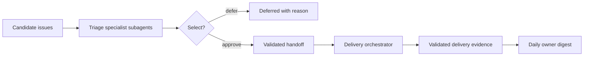

# Portfolio Orchestrator

## What this does

This is the entry point for a workflow that validates issues and PRs in the current repository, and then implements the accepted ones by delegating to `delivery-orchestrator` subagents. 

The first step of the workflow is to decide **what to work on**, and then delegate the work to `delivery-orchestrator` subagents; it never writes code or merges pull requests.



`delivery-orchestrator` owns the execution of every selected issue.

## Runtime delegation

For every specialist subagent, choose the first available runtime:

1. **Native delegation:** use the environment's built-in subagent/worker tool to launch a fresh specialist subagent in a new session.
2. **Non-interactive fallback:** if native delegation is unavailable but your own interactive runtime and `tmux` are available, render the assignment to `prompts/<assignment>.txt`, then launch a fresh non-interactive agent session in a uniquely named detached tmux session. For example, for Tau, use `tau --print --new-session --session-id <id> --cwd <cwd>` and save stdout and the exit status under `processes/`. Other supported runtimes (e.g., pi, OpenCode, etc.) may have different command-line flags. Invesetigate and implement the correct flags for the runtime you are using. 

3. **Otherwise:** block before starting the workflow and report that no supported
   delegation runtime is available.

Record the specialist subagent role, runtime, session ID, prompt path, start
time, report path, and terminal outcome. Poll at bounded intervals; never send
interactive keystrokes. On timeout, preserve logs and stop only that named tmux
session—never the tmux server. Treat a missing or invalid report as failure, not
as success inferred from output prose.

## Before starting

Derive the repository, default branch, instructions, checks, open PRs, open issues, active worktrees, and active runs. Ask once for any missing material choice:

- candidate issue scope and accepted project brief;
- selection threshold, concurrency limit, and daily budget;
- permission to dispatch and digest cadence.

Default policy: one low-risk issue, draft PRs only, and no merge, issue comments,

## Run directory and report paths

Before launching any specialist subagent, create one collision-resistant portfolio
run directory outside project worktrees: `~/.agents/runs/<portfolio-run-id>/`.

```text
<portfolio-run>/
  config.json                 accepted policy and repository facts
  brief.md                    accepted project brief
  issues/<issue-id>.json      immutable issue snapshots
  triage/<issue-id>.json      triage specialist subagent reports
  handoffs/<issue-id>.json    validated delivery handoffs
  delivery/<issue-id>.json    delivery-run summary and artifact link
  prompts/ processes/         rendered assignments and runtime logs
  transitions.jsonl           append-only portfolio decisions
  daily-digest.md
```

Use the issue number as `<issue-id>` when available, for example `issue-42`.
Otherwise derive a stable, filesystem-safe identifier before launch. For every
candidate, write its snapshot first, then pass these absolute paths into
`templates/triage.md`:

- `{{issue_artifact}}`: `issues/<issue-id>.json`
- `{{report_path}}`: `triage/<issue-id>.json`

When the triage specialist subagent finishes, validate that exact report before
selection. A selected issue's handoff must be written to
`handoffs/<issue-id>.json`; do not reuse a report path across issues or runs.

## Workflow

1. **Triage each candidate** using `templates/triage.md` in a fresh, read-only
   specialist subagent session. Require its JSON report.
2. **Defer** duplicates, active work, unclear/untestable work, misalignment,
   unresolved product decisions, policy conflicts, and sensitive work. Security,
   authentication, billing, destructive migration, production infrastructure,
   privacy, and legal work always need a human decision.
3. **Select** only issues that pass every gate, meet the threshold, and fit the
   approved concurrency and budget. Rank by score, user value, lower risk, then
   lower effort. Never select work merely to fill capacity.
4. **Write the per-issue handoff** with `templates/handoff.md`, validate it, then
   start one `delivery-orchestrator` run per selected issue.
5. **Collect evidence** from validated delivery reports and current PR state.
6. **Write the digest** with `templates/daily-digest.md`.

## Inputs and outputs

| Input | Output |
|---|---|
| Issue, project brief, policy, repository evidence | Per-issue triage report |
| Validated selected triage report | `handoff.json` for delivery |
| Delivery, verification, review, and PR evidence | Timestamped daily digest |

Retry only safe discovery. On missing evidence, ambiguity, conflict, or
sensitivity, defer and state the smallest needed human decision.

## When a PR is “ready”

Only call a PR ready for explicit merge approval when its configured checks pass
and independent review has no blocking or important findings. It remains
unmerged unless a named human approval and verified merge record exist.
